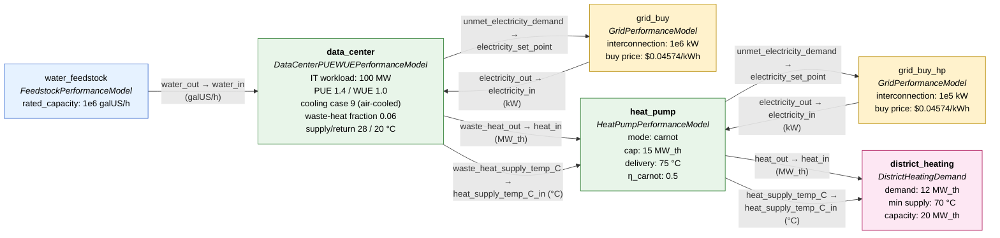

# Data center + heat pump + district heating — system diagram

Interconnected systems for [run_datacenter_waste_heat_heat_pump.py](run_datacenter_waste_heat_heat_pump.py).

## Data flow

## Connection table

Raw entries from `technology_interconnections` in [plant_config.yaml](plant_config.yaml).

| Source | Source signal | Sink | Sink signal | Kind |
|---|---|---|---|---|
| `data_center` | `unmet_electricity_demand` | `grid_buy` | `electricity_set_point` | signal |
| `water_feedstock` | `water` | `data_center` | `water` | pipe (auto) |
| `data_center` | `waste_heat_out` | `heat_pump` | `heat_in` | signal |
| `data_center` | `waste_heat_supply_temp_C` | `heat_pump` | `heat_supply_temp_C_in` | signal |
| `grid_buy_hp` | `electricity` | `heat_pump` | `electricity` | cable (auto) |
| `heat_pump` | `unmet_electricity_demand` | `grid_buy_hp` | `electricity_set_point` | signal |
| `heat_pump` | `heat_out` | `district_heating` | `heat_in` | signal |
| `heat_pump` | `heat_supply_temp_C` | `district_heating` | `heat_supply_temp_C_in` | signal |

## Operating-point numbers (from a full-year run)

| Quantity | Value |
|---|---|
| DC IT power → total facility power | 100 → 140 MW |
| Waste heat available (source) | ≈ 73,584 MWh/yr (8.4 MW × 8760 h) |
| HP electricity used | ≈ 27,216 MWh/yr |
| HP heat delivered @ 75 °C | ≈ 100,800 MWh/yr (COP ≈ 3.70) |
| DH demand met / unmet | 100,800 / 4,320 MWh/yr |
